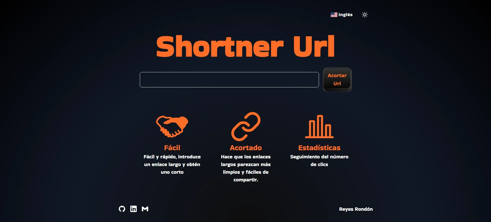

[](https://github.com/Reyes1921/shortner-url/blob/main/README.md)
[](https://github.com/Reyes1921/shortner-url/blob/main/README.es.md)

# Shortner Url

Aplicación para acortar enlaces de forma fácil y rápida con seguimiento del número de veces que se utiliza el enlace acortado. Eche un vistazo [shortner-url-fast](https://shortner-url-fast.vercel.app/)

## ⚙️ Funcionalidades

- Acortar enlaces muy grandes

- Seguimiento del número de veces que se utiliza el enlace acortado

## 👨‍💻 Tecnologías utilizadas

- [**React 18**](https://react.dev/) - La biblioteca para interfaces de usuario nativas y web.
- [**Next.js 14**](https://nextjs.org/) - The React Framework for the Web
- [**TypeScript**](https://www.typescriptlang.org/) - TypeScript es un lenguaje de programación fuertemente tipado que se basa en JavaScript.
- [**Tailwindcss**](https://tailwindcss.com/) - Framework de CSS para el diseño de páginas web.
- [**Prettier**](https://prettier.io/) + [prettier-plugin-tailwindcss](https://github.com/tailwindlabs/prettier-plugin-tailwindcss) - Formateador CSS.
- [**next-intl**](https://next-intl-docs.vercel.app/) - Internacionalización de Next.js
- [**Axios**](https://axios-http.com/) - Un sencillo cliente HTTP basado en promesas para el navegador y node.js
- [**react-qr-code**](https://www.npmjs.com/package/react-qr-code) - Un componente para React. Esta biblioteca funciona con React y React Native (utilizando React Native SVG).

## 🔗 Repositorio backend

[backend-shortner-url](https://github.com/Reyes1921/backend-shortner-url/blob/main/README.es.md)

## 🚀 Primeros pasos

En primer lugar, ejecute el servidor de desarrollo:

```bash
npm install
npm run dev
```

La aplicación se abre en el puerto 3000


<div align="center">


</div>

# ✉️ Contacto

- Correo electrónico: reyesjrondon@gmail.com
- [Portafolio](https://www.reyesrondon.dev/es)
- [Linkedin](https://www.linkedin.com/in/reyes-rondon/)
