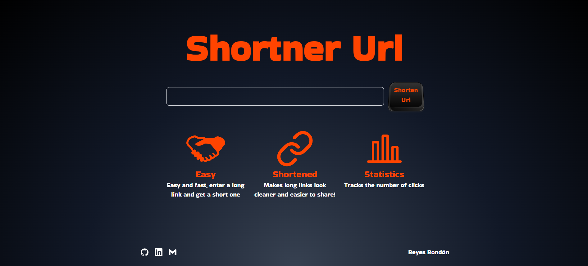

[](https://github.com/Reyes1921/shortner-url/blob/main/README.md)
[](https://github.com/Reyes1921/shortner-url/blob/main/README.es.md)

<h1 style="color: #ff4400">Shortner Url</h1>

Application to shorten links in an easy and fast way with tracking of the number of times the shortened link is used. Take a look [shortner-url-fast](https://shortner-url-fast.vercel.app/)

## Functionalities

- Shorten very large links

- Tracking the number of times the shortened link is used

## Technologies used

- Next.js 14
- TypeScript
- Tailwind CSS

## Backend repository page

[backend-shortner-url](https://github.com/Reyes1921/backend-shortner-url/blob/main/README.md)

## Getting Started

First, run the development server:

```bash
npm install
npm run dev
```

Application opens on port 3000


<div align="center">

</div>

# Contact

- E-mail address: reyesjrondon@gmail.com
- [Portfolio](https://reyesrondon.vercel.app/)
- [Linkedin](https://www.linkedin.com/in/reyes-rondon/?locale=en_US)
